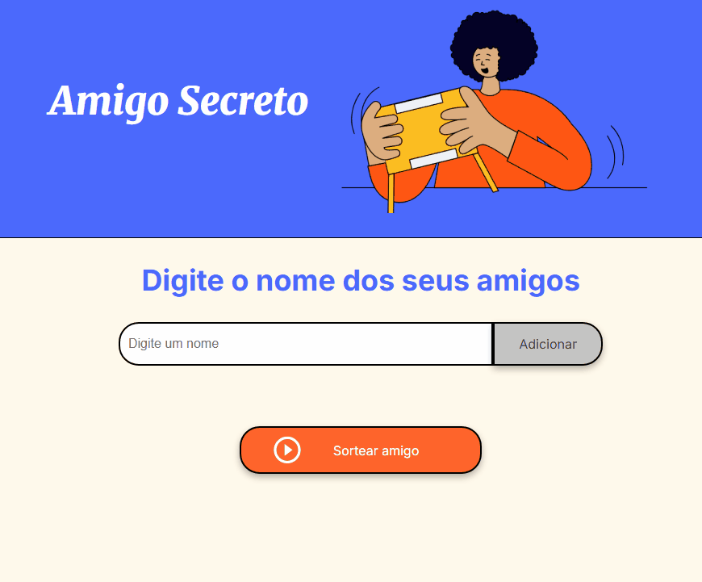
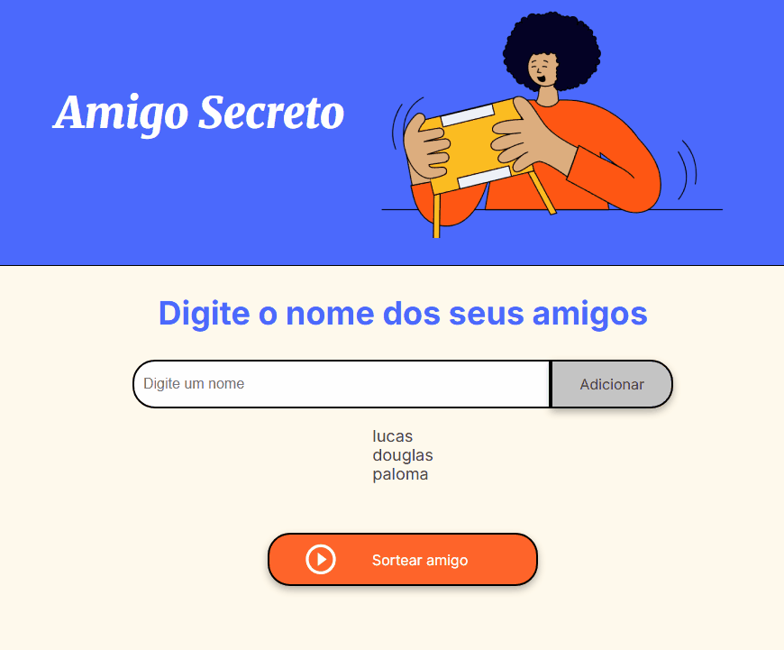

#  Jogo do Amigo Secreto


A ideia do jogo é que o usuário digite o nome de seus amigos, e o sistema irá sortear um nome que o usuário inseriu.

---

<br>

# :hammer: Funcionalidades do projeto
- `adicionar amigos`: O usuário através do campo "digite um nome" pode estar adicionando os seus amigos a uma lista

<br>

 

 <br>
 
- `Sorteio do amigo`: Quando o usuário já adicionou os seus amigos, ele pode estar agora sorteando um desses seus amigos através do botão "Sortear amigo".

<br>



<br>

## 🚀 Tecnologias utilizadas

<br>

- HTML  
- CSS  
- JavaScript  

---

<br>

## 📦 Como usar
Para utilizar e contribuir com o projeto, execute o seguinte comando no terminal git bash:
   ```bash
   git clone https://github.com/andrenevesxavier/jogo-do-amigo-secreto.git


